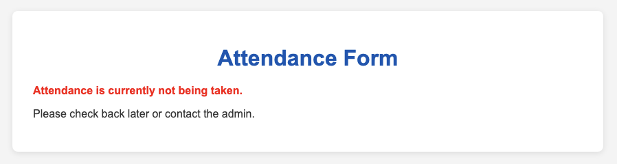
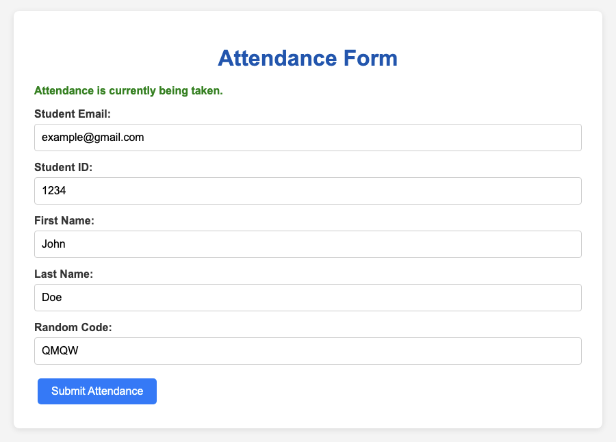
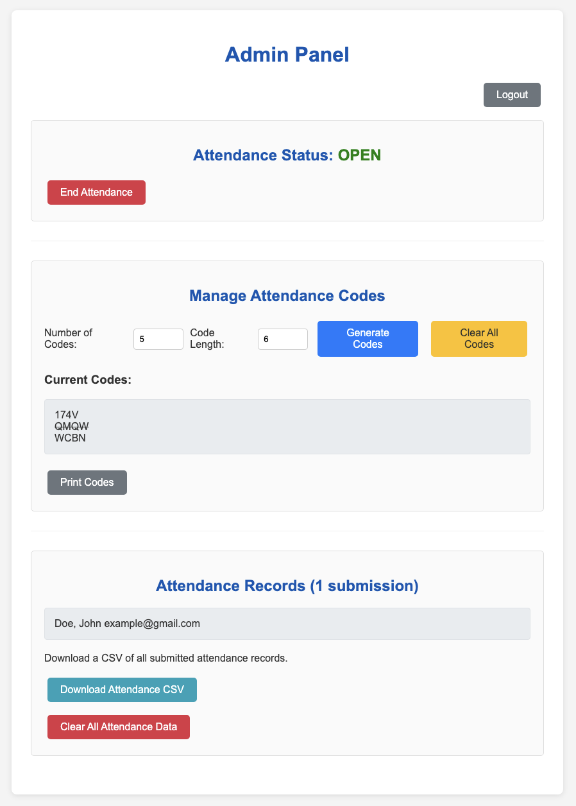

# Verified Attendance

Verified Attendance is a lightweight web server for collecting attendance in a university setting,
created for use in a lab section that I am teaching at the University of California Riverside.
I have made the program to be easily deployable for use by anyone who wants to log attendance.

The purpose of Verified Attendance is to track attendance in a way that one could only be marked as in attendance if he actually attended the lecture. The following is the workflow:

1. The admin (instructor) generates unique codes from the admin portal.
2. The admin opens the form for submission from the admin portal.
2. The admin prints out the codes and distributes (or otherwise distributes) one code to each student who attends the lecture.
    - I do this by using the "Print Codes" button to get a printout of the codes. Then, I hand out one code to each student who enters the lecture room.
3. Students fill out the attendance form by inputting their student information alongside a code.
    - A code is required for submission and can only be used once, preventing sharing.
4. After attendance has been taken, the admin may close the form, download the attendance, and reset the codes/attendance for the next class.

At any time, the admin can open and close the attendance form, generate more codes, delete all of the codes, download a CSV file of the attendance, or reset the attendance.

## Closed Attendance Form

## Filled Out Attendance Form

## Administrator Portal

